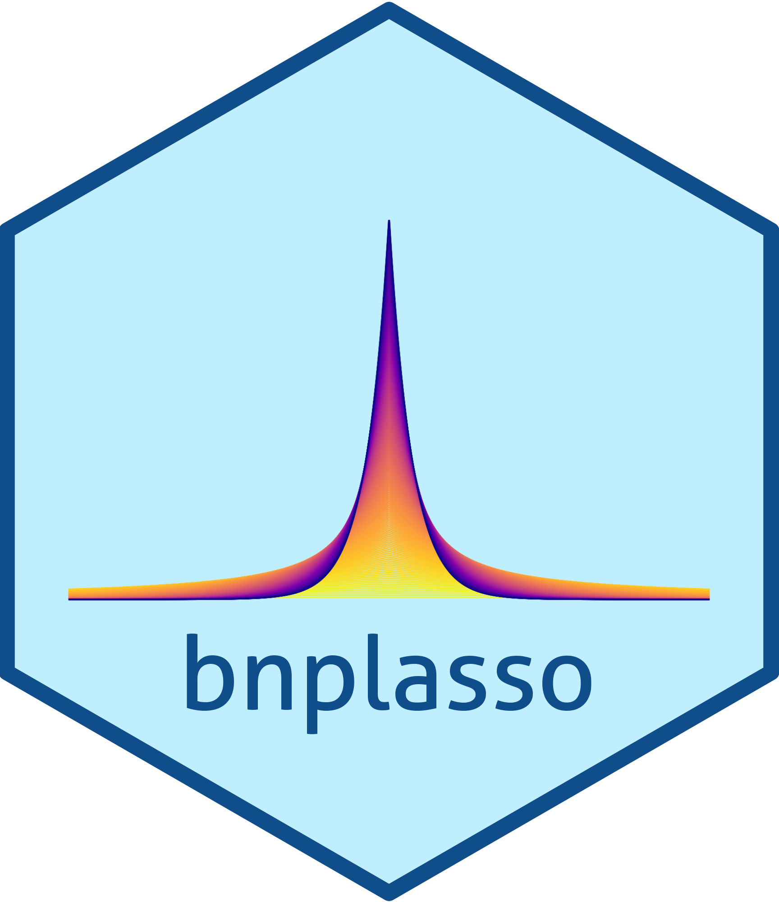

# bnplasso  

<!-- badges: start -->

[](https://github.com/marinsantiago/bnplasso/workflows/R-CMD-check/badge.svg)
[](https://lifecycle.r-lib.org/articles/stages.html#experimental)

<!-- badges: end -->

</br>

## Overview

The R package `bnplasso` (developer's version) implements the [Nonparametric Bayesian Lasso](https://doi.org/10.1080/10618600.2025.2572327) as described in Marin et al. (2025+).

The main routine of the package, ```bnplasso.lm()```, returns an object of S3 class, ```"lmBayes"```, which is supported by various methods 
such as ```print()```, ```summary()```, ```plot()```, ```fitted()```, ```residuals()```, ```coef()```, 
and ```predict()```, allowing users to quickly visualize, evaluate, and analyze the output in a familiar fashion. 
The function ```bnplasso.lm()``` is also capable of implementing the Bayesian Lasso (Park and Casella, 2008) and the Bayesian 
adaptive Lasso (Leng et al., 2014).

## Installation

You can install the latest developer's version via `devtools` as:

``` r
# install.packages("devtools")
devtools::install_github("marinsantiago/bnplasso")
```

A detailed `NEWS` changelog is available HERE

If you wish to reproduce the results from Marin et al. (2025+), you should download the version of the 
package employed at that time (`bnplasso` v0.1.0). That can easily be done by running in R

``` r
devtools::install_github("marinsantiago/bnplasso@3c87169")
```

Alternatively, if wish to reproduce the results from Marin et al. (2025+), you can also install
the package from the `bnplasso` folder in the supplementary materials to Marin et al. (2025+):

  1. In R, set your working directory to the folder `bnplasso`.
  
  2. Run the following R code:
  
``` r
# install.packages("devtools")
devtools::build()
devtools::install()
```

## Usage

First, let's start by loading some packages that are not required by `bnplasso`
but are necessary for this illustrative example.

``` r
library(mvtnorm)
```

Next, let's generate some synthetic predictors. 

``` r
p <- 200
rho <- 0.7
n.train <- 250
n.test <- 2000

set.seed(1)
Sigma.x <- rho^abs(matrix(1:p - 1, p, p, byrow = TRUE) - (1:p - 1))
X.train <- rmvnorm(n.train, rep(0, p), Sigma.x)
X.test <- rmvnorm(n.test, rep(0, p), Sigma.x)
```

Here, our training set is of size 250 (`n.train`), while our held-out set is of size 2000 `n.test`.
The covariate space has 200 dimensions (`p`), and each covariate vector is drawn from a
multivariate normal distribution with mean zero and an AR(1) covariance matrix,
where the correlation parameter is 0.7 (`rho`).

Now, we will generate the model parameters.

``` r
mu <- 10
sigma <- 1
beta <- c(rep(5, 20), rep(0, 180))
```

Here, the intercept term is equal to ten (`mu`), the residual standard deviation is one (`sigma`), 
and the vector of regression coefficients is generated in a way so that only 10% of its entries 
are nonzero (`beta`).

Finally, let's generate the responses. 

``` r
set.seed(1)
y.train <- mu + X.train %*% beta + rnorm(n.train, 0, sigma)
y.test <- mu + X.test %*% beta + rnorm(n.test, 0, sigma)
```

We can then apply the nonparametric Bayesian Lasso---from Marin et al. (2025+)---to these data 
through the function `bnplasso.lm()`. 

``` r
set.seed(1)
out.bnp <- bnplasso::bnplasso.lm(X.train, y.train)
```

Note that we are only passing into the function the design matrix and the response vector. 
If some user-supplied hyperparameters are not provided, the `bnplasso.lm()` function will 
attempt to automatically determine appropriate values for those hyperparameters. That being said,
different applications may require a more tailored prior specification. 

The method `summary()` provides information about the model fit. For instance, calling 

``` r
summary(out.bnp)
```

will print the following information in the console.

```
NONPARAMETRIC BAYESIAN LASSO 


Call details: 

a = 0.1 
b = 4e-05 
alpha = 0.4014365 
n.obs = 250 
n.preds = 200 
n.draws = 5000 (after burn-in and thinning) 
elapsed = 11.53845 secs 

Coefficients: 
            mean    sd   2.5%    25%    50%    75%  97.5%     n_eff
Intercept 10.020 0.064  9.894  9.976 10.020 10.064 10.147 3802.6851
beta_1     4.931 0.086  4.767  4.873  4.929  4.990  5.103 5000.0000
beta_2     5.114 0.108  4.897  5.042  5.112  5.188  5.323 5000.0000
beta_3     5.003 0.111  4.790  4.928  5.004  5.077  5.216 3759.5150
beta_4     5.114 0.107  4.904  5.041  5.115  5.185  5.325 4162.1842
⋮
```
It includes the posterior mean, standard deviation, various quantiles, and the MCMC effective sample 
size for each of the model parameters. 

The method `plot()` will produce various model diagnostics plots, including posterior 
predictive checks and residual diagnostics. 

``` r
plot(out.bnp)
```

 

 

One can also extract the individual chains containing posterior draws from each of the model 
parameters. For instance, let's extract and plot the chains for the intercept, beta_1, and beta_200. 

``` r
plot(out.bnp$Post.mu, type = "l", ylab = "", main = "mu")
plot(out.bnp$Post.beta[,1], type = "l", ylab = "", main = "beta_1")
plot(out.bnp$Post.beta[,200], type = "l", ylab = "", main = "beta_200")
```


 

Note that the chains are centered around the true parameter values and exhibit good mixing!

We can also visualize the posterior co-clustering probabilities, i.e., the posterior probabilities that 
two regression coefficients will be clustered together. 

``` r
bnplasso::coclust.probs(out.bnp$Post.clust_idx)
```


Note that the first 20 regression coefficients (which are nonzero) are clustered together with large probability,
while the remaining 180 (which are zero) are also clustered together with large probability. 
As such, the nonparametric Bayesian Lasso is accurately performing variable selection.

If desired, one can also obtain a point estimate of the partition of the regression coefficients. 

``` r
part <- bnplasso::get.partition(out.bnp$Post.clust_idx)
```

By default, the function `get.partition()` employs the variation of information loss
function from Wade and Ghahramani (2018). However, users can also employ 
the Binder loss function. One can visualize this partition with the function 
`coclust.point()`.

``` r
bnplasso::coclust.point(part)
```


Additional guidelines and help pages for using the package functions are available [here](https://marinsantiago.github.io/bnplasso-site/reference/index.html).
Source code to reproduce the results from Marin et al. (2025+) are available at [https://github.com/marinsantiago/bnplasso-examples](https://github.com/marinsantiago/bnplasso-examples).

## <a name="cite"></a> Citation

If you use any part of this package in your work, please consider citing our *JCGS* paper:

```TeX
@article{marin_bnplasso,
  title   = {Adaptive Shrinkage with a Nonparametric Bayesian Lasso},
  author  = {Santiago Marin and Bronwyn Loong and Anton H. Westveld},
  journal = {Journal of Computational and Graphical Statistics},
  year    = {2025},
  doi     = {10.1080/10618600.2025.2572327},
}
```

## Disclaimer

The software is provided "as is", without warranty of any kind, express or implied,
including but not limited to the warranties of merchantability, fitness for a particular
purpose and noninfringement. In no event shall the authors or copyright holders be liable
for any claim, damages, or other liability, whether in an action of contract, 
tort or otherwise, arising from, out of, or in connection with the software or the use
or other dealings in the software.

## <a name="refs"></a> References

Leng, C., Tran, M.-N., and Nott, D. (2014). "Bayesian Adaptive Lasso." *Annals of the Institute of Statistical Mathematics*, 66, 221–244

Marin, S., Loong, B., and Westveld, A. H. (2025+), "Adaptive Shrinkage with a Nonparametric Bayesian Lasso." *Journal of Computational and Graphical Statistics*. [doi:10.1080/10618600.2025.2572327](https://doi.org/10.1080/10618600.2025.2572327)

Park, T. and Casella, G. (2008). "The Bayesian Lasso." *Journal of the American Statistical Association*, 103 (482), 681–686.

Wade, S. and Ghahramani, Z. (2008). "Bayesian cluster analysis: Point estimation and credible balls (with discussion)." *Bayesian Analysis*, 13 (2), 559–626.
